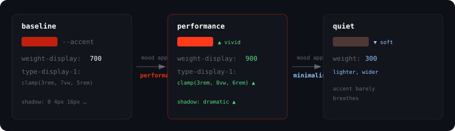

# Tincture

> A drop changes the whole pour.

A **build-time CSS token system**. Declare colors as `(token, surface, mood)` tuples.
It emits the cascade. It scans for hardcoded values. It runs WCAG 2.1 + APCA
contrast checks before you ship. One mood delta shifts every surface together.

```diff
- color: #c4520e;                /* deep orange. trust me. */
+ color: var(--promo-text);      /* deep orange light, gold dark, math-checked both */
```

**Version:** 0.2.2 · **Status:** Active  
**npm:** `curtismercier/tincture-css` · **License:** MIT

---

## A tour

**1. Declare your colors.**

```jsonc
// tincture/registry.json
{
  "version": "0.2.2",
  "name": "my-project/tincture",
  "tokens": {
    "ink": {
      "kind": "color",
      "axes": ["surface"],
      "values": {
        "default": "#1A1A1A",
        "surface=light": "#F0EFF4"
      },
      "doc": "Primary text. High contrast on both surfaces."
    },
    "accent": {
      "kind": "color",
      "axes": ["surface"],
      "values": {
        "default": "#00C8FF",
        "surface=light": "#0066CC"
      },
      "role": "brand"
    }
  }
}
```

**2. Generate the cascade.**

```bash
tincture codegen
```

Emits `_generated/foundation.css` with cascade rules per axis-cell, plus
`manifest.json` and `tokens.d.ts`.


**3. Scan for gaps.**

```bash
tincture scan                     # find hardcoded colors
tincture scan-tailwind            # find Tailwind classes to tokenize
tincture contrast                 # WCAG + APCA per surface pair
```

**4. Apply a mood.**

A mood is a coordinated delta across all surfaces. One file, one command.

```bash
tincture mood list                # see available palette deltas
tincture mood apply performance   # shift warmth, saturation, contrast
```



**5. Visualize.**

```bash
tincture palette                  # SVG of every token per surface
tincture tokens list              # all tokens with live color swatches
```

---

## CLI

```
  Tokens
    tokens list|get|find|impact|set    inspect and edit tokens

  Pipeline
    init                               scaffold registry + foundation
    codegen                            re-emit _generated/ from registry
    validate                           run registry validator
    create                             create a new token

  Audit
    scan                               find hardcoded colors in CSS / Tailwind / inline
    scan-tailwind                      scan Tailwind classes for tokenization
    verify                             check token usage matches declarations
    contrast                           WCAG 2.1 + APCA matrix per surface
    apply-typography                   auto-migrate heading typography to tokens

  Mood
    mood list                          list mood presets
    mood apply <name>                  apply a coordinated palette delta

  Visualize
    palette                            SVG visual of current palette
    preview                            preview output
    status                             project summary
```

Pass `--json` for machine-readable output.

---

## Installation

```bash
npm install curtismercier/tincture-css
```

Then scaffold a registry and generate your foundation:

```bash
npx tincture init
npx tincture codegen
```

Import the generated CSS in your project:

```css
@import "tincture/_generated/foundation.css";
body { background: var(--bg); color: var(--ink); }
```

Create a `tincture.config.json` if your registry lives at a custom path:

```json
{
  "registryPath": "src/styles/tincture/registry.json",
  "outDir": "src/styles/tincture/_generated",
  "moodsDir": "src/styles/tincture/moods"
}
```

---

## How it works

Tokens are **value matrices**, not pairs. A token's value depends on which
axes are active — surface (light/dark), flavor (warm/cool), mood, elevation.
Codegen emits one cascade rule per axis-cell.

```
token "accent"
  surface=light  →  #0066CC
  surface=dark   →  #00C8FF
  mood=warm      →  shift hue +8°
```

No runtime. No components. Just CSS custom properties and a build step.

---

## Agent skill

A companion skill (`tincture.skill.md`) teaches agents how to init, scan,
build, verify, and mood-apply. Install via:

```bash
gh skill install curtismercier/tincture-css
```

---

## Consumers

Extracted from production on **soma.gravicity.ai** and **arzadon fitness studio**.
Dual-contrast (WCAG 2.1 + APCA) verified across both surfaces.

---

## License

MIT — code. The design methodology and specification text are CC BY 4.0.
